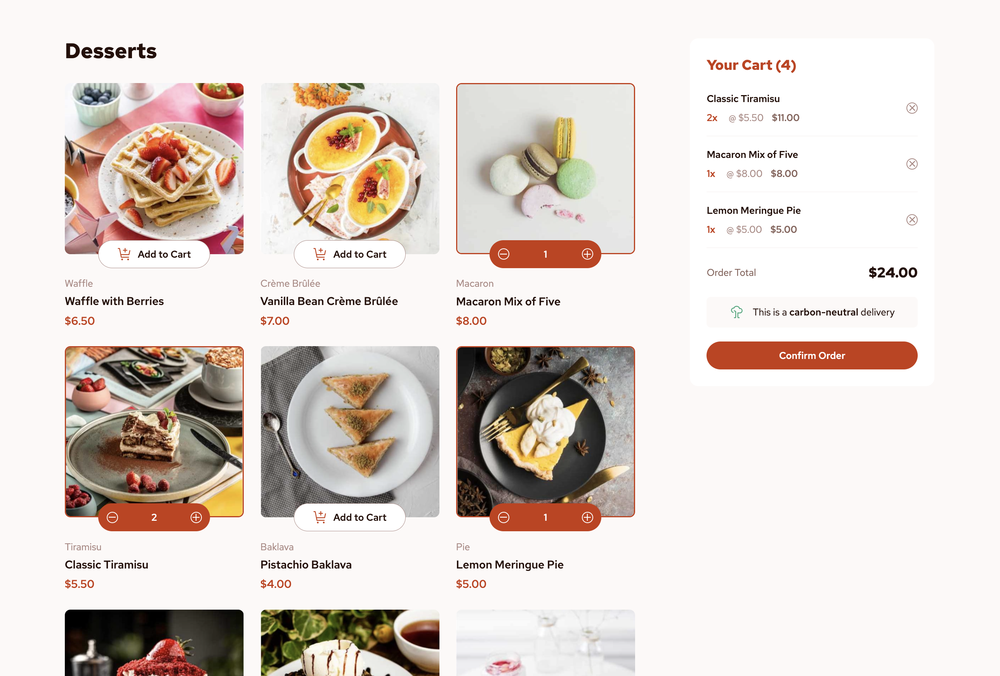

# Frontend Mentor - Product list with cart solution

This is a solution to the [Product list with cart challenge on Frontend Mentor](https://www.frontendmentor.io/challenges/product-list-with-cart-5MmqLVAp_d). Frontend Mentor challenges help you improve your coding skills by building realistic projects.

## Table of contents

- [Overview](#overview)
  - [The challenge](#the-challenge)
  - [Screenshot](#screenshot)
  - [Links](#links)
- [My process](#my-process)
  - [Built with](#built-with)
  - [What I learned](#what-i-learned)
  - [Useful resources](#useful-resources)
- [Author](#author)

## Overview

### The challenge

Users should be able to:

- Add items to the cart and remove them
- Increase/decrease the number of items in the cart
- See an order confirmation modal when they click "Confirm Order"
- Reset their selections when they click "Start New Order"
- View the optimal layout for the interface depending on their device's screen size
- See hover and focus states for all interactive elements on the page

### Screenshot

### Links

- Solution URL: [https://github.com/maryam-nasir/fm-product-list-with-cart](https://github.com/maryam-nasir/fm-product-list-with-cart)
- Live Site URL: [https://fm-product-list-with-cart-one.vercel.app/](https://fm-product-list-with-cart-one.vercel.app/)

## My process

### Built with

- Semantic HTML5 markup
- Tailwind CSS
- Flexbox
- Mobile-first workflow
- TypeScript
- [React](https://reactjs.org/) - JS library
- React Context for State Management

### What I learned

Developed this project using TypeScript, further strengthening my TypeScript skills and for the first time, I used the mobile-first design approach to style my project.

### Useful resources

- [Display number as currency](https://www.reddit.com/r/reactjs/comments/vjto9t/how_to_display_money_like_1310_in_react/) - This thread helped me formatting the price in USD currency.

## Author

- LinkedIn - [Maryam Nasir](https://www.linkedin.com/in/maryam-nasir/)
- Frontend Mentor - [@maryam-nasir](https://www.frontendmentor.io/profile/maryam-nasir)
- Twitter - [@maryamnasir555](https://twitter.com/maryamnasir555)
